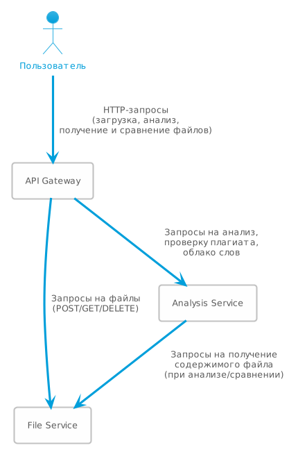
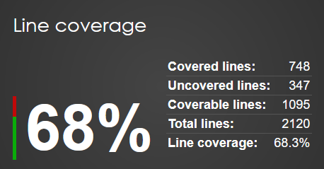

# Отчет по контрольной работе №2

## 1. Архитектура приложения

### Структура системы

Приложение построено на архитектуре микросервисов и включает в себя три основных сервиса:

1. **API Gateway** — маршрутизирует запросы клиентов и предоставляет единую точку входа в систему.
2. **File Service** — отвечает за хранение и получение файлов.
3. **Analysis Service** — осуществляет текстовый анализ, выявляет плагиат и строит облака слов.

Взаимодействие между сервисами происходит по HTTP с использованием REST API. Все сервисы контейнеризованы с помощью Docker и управляются через Docker Compose.

### Схема взаимодействия сервисов




## 2. Описание функциональности

### Основные функции

- **Текстовый анализ**: подсчет количества абзацев, слов и символов в загруженных текстовых файлах.
- **Проверка на плагиат**: сравнение текстов с помощью алгоритма Левенштейна.
- **Генерация облака слов**: визуализация частоты встречаемости слов через внешний API QuickChart.
- **Управление файлами**: загрузка, получение списка и просмотр файлов.

### Эндпоинты сервисов

#### API Gateway

- `GET /health` — состояние всех сервисов.
- `POST /upload` — загрузка текстового файла и инициация анализа.
- `GET /files` — список всех файлов.
- `GET /files/{id}` — получение файла по идентификатору.
- `GET /analysis/{id}` — получение результатов анализа.
- `POST /compare` — сравнение файлов на плагиат.
- `GET /wordcloud/{fileId}` — генерация облака слов.

#### File Service

- `GET /health` — проверка статуса сервиса.
- `POST /files` — загрузка файла.
- `GET /files` — список всех файлов.
- `GET /files/{id}` — получение файла по ID.

#### Analysis Service

- `GET /health` — проверка статуса сервиса.
- `POST /analysis` — анализ файла по ID.
- `GET /analysis/{id}` — получить результаты анализа.
- `POST /compare` — сравнение файлов на плагиат.
- `GET /wordcloud/{fileId}` — получить облако слов.

## 3. Используемые технологии

- **ASP.NET Core 8.0** — backend-фреймворк.
- **PostgreSQL** — база данных для хранения файлов и результатов анализа.
- **Docker/Docker Compose** — контейнеризация сервисов.
- **Swagger** — ручное тестирование API.
- **xUnit, Moq**: Тестирование.
- **QuickChart API**: Генерациця облака слов.

## 4. Запуск приложения

```bash
docker-compose up --build
```

API Gateway будет доступен по адресу http://localhost:8080, Swagger — http://localhost:8080/swagger.

## 5. Тестирование
### Проект покрыт unit-тестами с помощью xUnit и Moq. Для запуска всех тестов и генерации отчета о покрытии используйте:

```bash
# Linux/Mac
./run_tests.sh

# Windows
./run_tests.bat
```

Отчет о покрытии кода тестами можно посмотреть в [test-results/coveragereport/index.html](test-results/coveragereport/index.html)


### Покрытие кода тестами превышает 65%:



### Тестирование API
Для тестирования ручек можно использовать Swagger или коллекцию [Postman](TextScanner.postman_collection.json)
