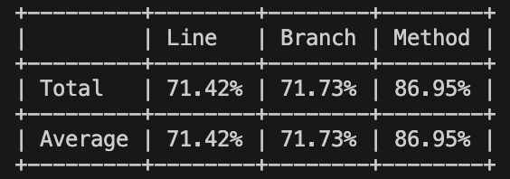

# Отчет

## Реализованный функционал и его расположение

### 1. Работа с животными
- **Сущность животного**: `ZooWebApp.Domain/Entities/Animal.cs`
- **Основные операции с животными**: `ZooWebApp.Application/Services/AnimalService.cs`
- **Репозиторий животных**: `ZooWebApp.Infrastructure/Repositories/InMemoryAnimalRepository.cs`
- **API-контроллер животных**: `ZooWebApp.Presentation/Controllers/AnimalsController.cs`
- **DTO модели животных**: `ZooWebApp.Presentation/Models/AnimalDto.cs`

### 2. Управление вольерами
- **Объект-значение вольера**: `ZooWebApp.Domain/ValueObjects/Enclosure.cs`
- **Типы вольеров**: `ZooWebApp.Domain/Enums/EnclosureType.cs`
- **Репозиторий вольеров**: `ZooWebApp.Infrastructure/Repositories/InMemoryEnclosureRepository.cs`
- **API-контроллер вольеров**: `ZooWebApp.Presentation/Controllers/EnclosuresController.cs`
- **DTO модели вольеров**: `ZooWebApp.Presentation/Models/EnclosureDto.cs`

### 3. Перемещение животных между вольерами
- **Сервис перемещения**: `ZooWebApp.Application/Services/AnimalTransferService.cs`
- **Событие перемещения**: `ZooWebApp.Domain/Events/AnimalTransferredEvent.cs`

### 4. Управление кормлениями
- **Объект-значение расписания кормления**: `ZooWebApp.Domain/ValueObjects/FeedingSchedule.cs`
- **Типы пищи**: `ZooWebApp.Domain/Enums/FoodType.cs`
- **Сервис кормления**: `ZooWebApp.Application/Services/FeedingScheduleService.cs`
- **API-контроллер расписаний**: `ZooWebApp.Presentation/Controllers/FeedingSchedulesController.cs`
- **Событие кормления**: `ZooWebApp.Domain/Events/FeedingTimeEvent.cs`

### 5. Статистика зоопарка
- **Сервис статистики**: `ZooWebApp.Application/Services/ZooStatisticsService.cs`
- **API-контроллер статистики**: `ZooWebApp.Presentation/Controllers/ZooStatisticsController.cs`

### 6. Общие компоненты и вспомогательные классы
- **Базовая сущность**: `ZooWebApp.Domain/Common/EntityBase.cs`
- **Интерфейс доменного события**: `ZooWebApp.Domain/Common/Interfaces/IDomainEvent.cs`
- **Интерфейсы репозиториев**: 
  - `ZooWebApp.Domain/Common/Interfaces/IAnimalRepository.cs`
  - `ZooWebApp.Domain/Common/Interfaces/IEnclosureRepository.cs`
- **Перечисления**: 
  - `ZooWebApp.Domain/Enums/Gender.cs`
  - `ZooWebApp.Domain/Enums/HealthStatus.cs`
  - `ZooWebApp.Domain/Enums/Species.cs`

## Реализация концепции Domain-Driven Design

### 1. Ограниченный контекст
Приложение представляет собой единый ограниченный контекст зоопарка, который фокусируется на управлении животными, вольерами и расписаниями кормления.

### 2. Многослойная архитектура
Реализация разделена на четыре основных слоя:
- **Доменный слой** (`ZooWebApp.Domain`): содержит бизнес-модели и правила
- **Слой приложения** (`ZooWebApp.Application`): оркестрирует доменные объекты
- **Инфраструктурный слой** (`ZooWebApp.Infrastructure`): реализует взаимодействие с внешними системами
- **Слой презентации** (`ZooWebApp.Presentation`): предоставляет интерфейс для взаимодействия

### 3. Сущности
- **Animal**: основная сущность, идентифицируемая по своему Id
- Методы для обновления состояния сущности инкапсулируют бизнес-правила, например:
  - `UpdateDetails`: обновляет информацию о животном
  - `AssignToEnclosure`: перемещает животное в вольер с проверкой совместимости
  - `RemoveFromEnclosure`: удаляет животное из вольера

### 4. Объекты-значения
- **Enclosure**: представляет неизменяемую концепцию вольера с методами:
  - `CanHouseSpecies`: проверяет возможность размещения вида животного
  - `HasCapacity`: проверяет наличие свободного места
- **FeedingSchedule**: неизменяемый объект расписания кормления

### 5. Агрегаты и корни агрегатов
- **Animal** является корнем агрегата, содержащего:
  - Коллекцию `FeedingSchedules`
  - Ссылку на `Enclosure`
- Весь доступ к элементам агрегата происходит через его корень

### 6. Доменные события
- **AnimalTransferredEvent**: генерируется при перемещении животного между вольерами
- **FeedingTimeEvent**: создается при кормлении животного
- События создаются через методы доменной модели и могут использоваться для синхронизации состояния или уведомления других частей системы

### 7. Репозитории
- **IAnimalRepository**: абстракция для работы с коллекцией животных
- **IEnclosureRepository**: абстракция для работы с коллекцией вольеров
- Реализации через классы `InMemoryAnimalRepository` и `InMemoryEnclosureRepository`

### 8. Сервисы предметной области
Функциональность, которая не относится естественным образом к сущностям или объектам-значениям, реализована через сервисы:
- **AnimalTransferService**: координирует перемещение животных
- **FeedingScheduleService**: управляет расписаниями кормления
- **ZooStatisticsService**: предоставляет аналитические функции по зоопарку

## Тесты

В основных частях программы тестовое покрытие превышает 70%:

